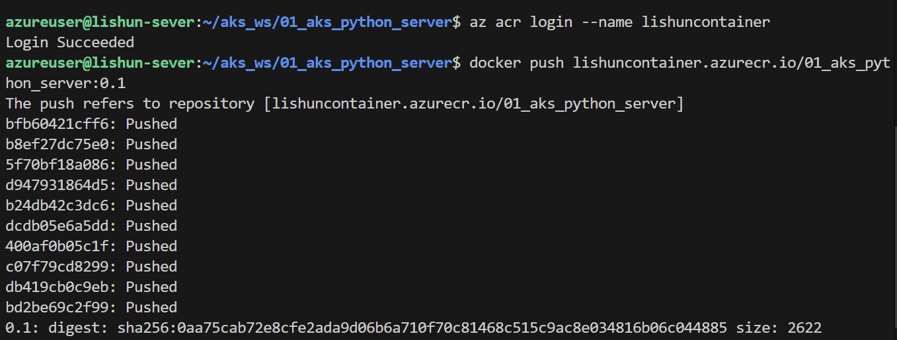
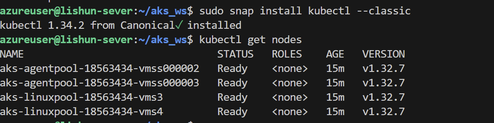
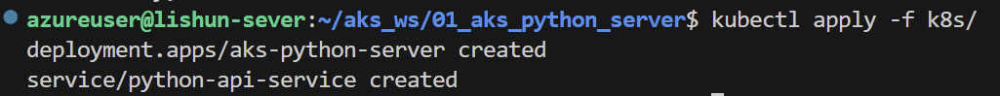
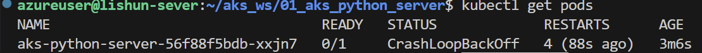
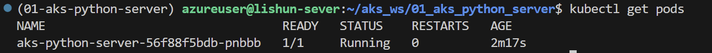

## 1. 构建Docker的命令
```
docker build -t 01_aks_python_server -f docker/Dockerfile .
```

## 2. docker启动服务
```
docker run --rm -it -p 11111:80 01_aks_python_server:latest
```

主要检查一下是不是有问题

## 3. 上传到 Azure Container Registry

### 3.1 az cli 登录
  az login
> 登录 ACR 

```
az acr login --name lishuncontainer
```

### 3.2 打标记
  docker tag 01_aks_python_server:latest lishuncontainer.azurecr.io/01_aks_python_server:0.1

### 3.3 推送
  docker push lishuncontainer.azurecr.io/01_aks_python_server:0.1



## 4. 采用 k8s 的 yaml 部署服务

### 4.1 登录上 aks 

az aks get-credentials \
  --resource-group lishun-ask \
  --name lishun-aks

> 检查是否能连接上
  kubectl get nodes



### 4.2 编写 deployment.yaml 和 service.yaml 启动服务
./k8s/
├── deployment.yaml
└── service.yaml

> deployment.yaml 和 service.yaml 分别表示 启动pod 和服务对外暴露的

### 4.3 部署服务
```
kubectl apply -f k8s/
```



#### 4.3.1 服务出错
服务出现了问题，排查的方式
```
kubectl get pods
```

进入查看报错日志
```
kubectl logs aks-python-server-56f88f5bdb-xxjn7
```

#### 4.3.2 检查服务
成功运行

使用  kubectl get svc 去查看自己的外网IP地址【EXTERNAL-IP】

### 4.4 删除服务，回滚
在做实验的过程会出现服务启动不了，一致无法启动，可以删除服务，重新实验

> 先查看自己有哪些 deployments 和 service
```
kubectl get deployments
kubectl get svc
```
> 再查看自己所有的pod
```
kubectl get pods -o wide
```


1. 删除对应的 Deployment
```
kubectl describe deployment aks-python-server
```

2. 删除对应的 Service
```
kubectl describe service python-api-service
```
3. 检查是否删除干净了
```
kubectl describe deployment aks-python-server
kubectl describe service python-api-service
```

## 5. 配置证书和域名
> 如何在 aks 中配置证书和相关的域名？
> 我们继续操作学习


